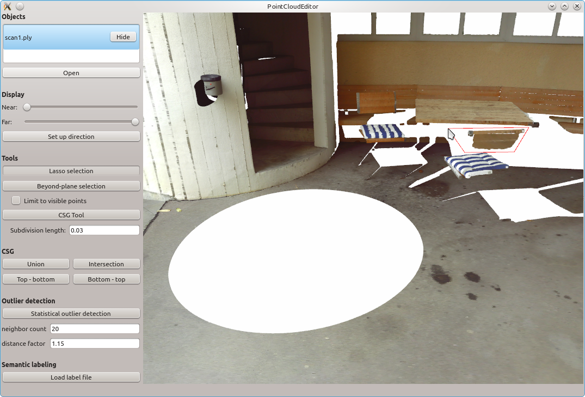
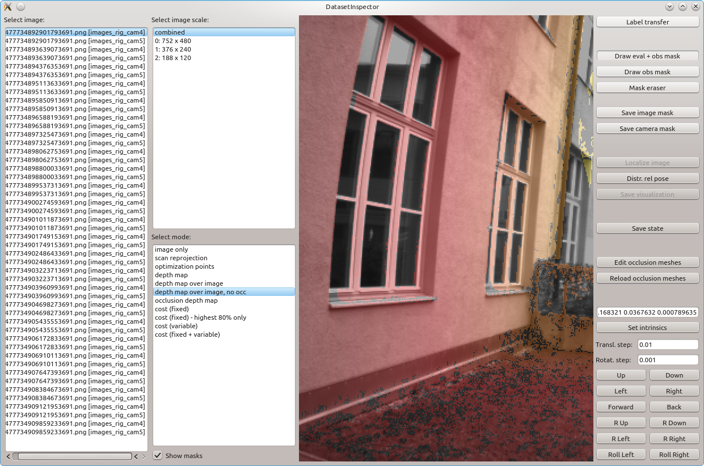
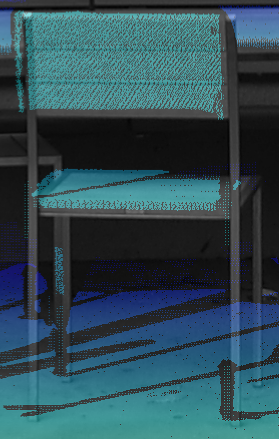
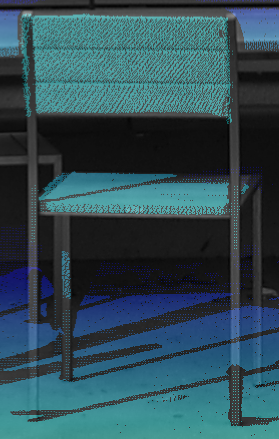

# Table of contents #

* [Overview](#overview)
* [Building](#building)
* [Step-by-step example (individual images)](#step-by-step-example-individual-images)
* [Step-by-step example (camera rig images)](#step-by-step-example-camera-rig-images)
* [Processing pipeline](#processing-pipeline)


# Overview #

The ETH3D dataset processing tools consist of a number of programs for creating 3D reconstruction evaluation datasets from images and laser scans.
This includes tools for laser scan processing (outlier removal, scan alignment, ...) and image alignment wrt. laser scans (by optimizing for color consistency among images and the scans).
The tools additionally include support for semantic labeling of point clouds and limited support for scan-image alignment for depth images, which was not used for the ETH3D benchmark.

If you use this code for research, please cite our paper:

T. Schöps, J. L. Schönberger, S. Galliani, T. Sattler, K. Schindler, M. Pollefeys, A. Geiger, "A Multi-View Stereo Benchmark with High-Resolution Images and Multi-Camera Videos", Conference on Computer Vision and Pattern Recognition (CVPR), 2017. \[[Bibtex](https://www.eth3d.net/data/schoeps2017cvpr.bib)\]\[[PDF](https://www.eth3d.net/data/schoeps2017cvpr.pdf)\]\[[Supplementary](https://www.eth3d.net/data/schoeps2017cvpr-supp.pdf)\]

The pipeline for processing a dataset is as follows:

* [Data acquisition](#data-acquisition), input is expected as image files and colored point clouds as PLY
* Creating the [file system layout](#file-system-layout)
* [`PointCloudCleaner`](#automatic-point-cloud-cleanup): remove some point cloud outliers automatically
* [`PointCloudEditor`](#manual-point-cloud-cleanup): remove remaining point cloud outliers manually
* [`CubeMapRenderer`](#cube-map-rendering): render cube map images from laser scans
* Use an [external SfM tool](#external-sfm) to estimate an initial alignment between the scans and the images
* [`SfMScaleEstimator`](#sfm-scale-estimation): estimates the scale of the SfM model
* [`ICPScanAligner`](#scan-pose-refinement): refine the scan alignment using point-to-plane ICP
* [`NormalEstimator`](#scan-normal-estimation): estimate normal vectors for the scans
* Use an [external surface reconstruction tool](#external-surface-reconstruction) to reconstruct a surface mesh for occlusion handling
* [`SplatCreator`](#splat-creation): create splats for points which are not represented in the surface mesh
* [`DatasetInspector`](#dataset-inspection): allows to view the aligned images and draw image masks
* [`ImageRegistrator`](#image-registrator): refine the image alignment and intrinsics using dense image alignment
* [`GroundTruthCreator`](#ground-truth-creation): create the ground truth data for evaluation

First, examples of using the pipeline are described for the case of individual images (such as taken by a DSLR camera), and for the case of images taken by a fixed camera rig.
Then all pipeline steps are described in detail below.


# Building #

Building was tested on Ubuntu 18.04 and 16.04.
It would be expected that later Ubuntu versions could also be used with little effort.

The following external dependencies are required:

* Eigen (>= 3.3)
* GMP
* GLEW
* boost
* glog
* OpenCV (>= 4)
* OpenGV
* PCL (>=1.8)
* Qt (>=5)

OpenCV was used in version 4.1.2, for PCL version 1.8.1 was used and for Qt, version 5 was used.

The code can be built using CMake, for example as follows:
```
mkdir build_RelWithDebInfo
cd build_RelWithDebInfo
cmake -DCMAKE_BUILD_TYPE=RelWithDebInfo ..
make -j
```

Note : Problems occur when running code on ubuntu18.04+ when PCL is built from source, but not when using `libpcl-dev` apt package.

A Dockerfile is given to build everything from scratch in ubuntu 20.04.

# Step-by-step example (individual images) #

For this example, the pipeline is run on the "terrace" DSLR training dataset of the ETH3D benchmark.

* Go to https://www.eth3d.net/datasets and download `terrace_dslr_jpg.7z`, `terrace_scan_clean.7z`, and `terrace_dslr_occlusion.7z`.
* Unzip all archives into the same directory.
* In order to conform to the expected directory layout for the pipeline, move the `images/dslr_images` folder one level higher (such that the path reads only `dslr_images` and is on the same level as `masks_for_images`).
* The `dslr_calibration_jpg` and `occlusion` folders will not be used, since this data is generated by the pipeline.
  The same applies to the file `scan_clean/scan_alignment.mlp`.
  The remaining folders,`dslr_images`, `masks_for_images`, and `scan_clean` contain the input data to the pipeline.
  The laser scans in `scan_clean` are already cleaned from outliers.
* Generate a cube map for each laser scan:
  ```
  # cd to the dataset directory containing the dslr_images and other folders
  export PIPELINE_PATH=/path/to/dataset_pipeline/build  # Adjust this to your environment.
  mkdir cube_maps
  ${PIPELINE_PATH}/CubeMapRenderer -c scan_clean/scan1.ply -o cube_maps/scan1.ply --size 2048
  ${PIPELINE_PATH}/CubeMapRenderer -c scan_clean/scan2.ply -o cube_maps/scan2.ply --size 2048
  ```
* An SfM (Structure-from-Motion) reconstruction containing the DSLR images and the cube map images must be created using an external tool.
  We provide an example SfM reconstruction [here](https://www.eth3d.net/data/pipeline_examples/dslr_example_model.7z) (unzip into the same directory as the input data archives).
* Estimate the scale of the Structure-from-Motion reconstruction and generate a scaled SfM model and a MeshLab project file with the initial laser scan alignment:
  ```
  mkdir sparse_reconstruction_scaled
  ${PIPELINE_PATH}/SfMScaleEstimator -s sparse_reconstruction -si . -i scan_clean -o sparse_reconstruction_scaled --cube_map_face_camera_id 0
  ```
* Refine the laser scan alignment using ICP:
  ```
  ${PIPELINE_PATH}/ICPScanAligner -i sparse_reconstruction_scaled/meshlab_project.mlp -o scan_clean/scan_alignment.mlp -d 0.01 --max_iterations 100 --convergence_threshold 1e-10 --number_of_scales 4
  ```
* Estimate normal vectors for the scans and generate the input file for surface reconstruction:
  ```
  mkdir surface_reconstruction
  ${PIPELINE_PATH}/NormalEstimator -i scan_clean/scan_alignment.mlp -o surface_reconstruction/point_cloud_with_normals.ply --neighbor_count 8
  ```
* Use the external Poisson Surface Reconstruction tool [(download)](http://www.cs.jhu.edu/~misha/Code/PoissonRecon/) to perform the surface reconstruction:
  ```
  export POISSON_RECON_PATH=/path/to/PoissonRecon  # Adjust this to your environment.
  ${POISSON_RECON_PATH}/PoissonRecon --in surface_reconstruction/point_cloud_with_normals.ply --out surface_reconstruction/surface.ply --depth 13 --colors --data 16 --density
  ```
* Create splats for points which are not well represented in the surface reconstruction:
  ```
  ${PIPELINE_PATH}/SplatCreator --point_normal_cloud_path surface_reconstruction/point_cloud_with_normals.ply --mesh_path surface_reconstruction/surface.ply --output_path surface_reconstruction/splats.ply --distance_threshold 0.02
  ```
* At this point, the dataset could be inspected to verify that it is in a good state using `DatasetInspector`.
  This is skipped here since for this example, the state should be sufficient.
  (For the ETH3D benchmark, the surface mesh was edited at this stage to better reflect the geometry of the chairs and tables.)
  Example usage of the `DatasetInspector` tool is given below (replace the value for `--state_path` with `sparse_reconstruction_scaled/colmap_model`, and add `--camera_ids_to_ignore 0` to inspect the initial state).
* Refine the image poses and intrinsics.
  This example assumes that the original `dslr_calibration_jpg` folder has been moved away or deleted.
  ```
  mkdir multi_res_point_cloud_cache
  mkdir observations_cache
  mkdir dslr_calibration_jpg
  ${PIPELINE_PATH}/ImageRegistrator \
      --scan_alignment_path scan_clean/scan_alignment.mlp \
      --occlusion_mesh_path surface_reconstruction/surface.ply \
      --occlusion_splats_path surface_reconstruction/splats.ply \
      --multi_res_point_cloud_directory_path multi_res_point_cloud_cache \
      --image_base_path . \
      --state_path sparse_reconstruction_scaled/colmap_model \
      --output_folder_path dslr_calibration_jpg \
      --observations_cache_path observations_cache \
      --camera_ids_to_ignore 0
  ```
  In case you would like to restart the optimization with the same settings from the state saved after completing a scale level, use the following command (for the example of starting with the `scale_0.0625_state`):
  ```
  ${PIPELINE_PATH}/ImageRegistrator \
      --scan_alignment_path scan_clean/scan_alignment.mlp \
      --occlusion_mesh_path surface_reconstruction/surface.ply \
      --occlusion_splats_path surface_reconstruction/splats.ply \
      --multi_res_point_cloud_directory_path multi_res_point_cloud_cache \
      --image_base_path . \
      --state_path dslr_calibration_jpg/scale_0.0625_state \
      --output_folder_path dslr_calibration_jpg \
      --observations_cache_path observations_cache \
      --initial_scaling_factor 0.125 \
      --cache_observations 1
  ```
  In case you restart the optimization with different settings, delete the `multi_res_point_cloud_cache` and `observations_cache` folders.
* At this point, the process is done.
  The camera poses and intrinsics are output as a COLMAP model in `dslr_calibration_jpg/scale_1_state`.
  The scan alignment is available as a MeshLab project file `scan_clean/scan_alignment.mlp`.
  If you would like to inspect the result, call the `DatasetInspector` as follows:
  ```
  ${PIPELINE_PATH}/DatasetInspector \
      --scan_alignment_path scan_clean/scan_alignment.mlp \
      --occlusion_mesh_path surface_reconstruction/surface.ply \
      --occlusion_splats_path surface_reconstruction/splats.ply \
      --multi_res_point_cloud_directory_path multi_res_point_cloud_cache \
      --image_base_path . \
      --state_path dslr_calibration_jpg/scale_1_state
  ```
  If you would like to create ground truth depth maps and / or a ground truth point cloud where only points observed by at least two images are occluded (such that it is fair to use them for multi-view stereo evaluation), call the `GroundTruthCreator` (adapt the `write_<...>` parameters as desired):
  ```
  ${PIPELINE_PATH}/GroundTruthCreator \
      --scan_alignment_path scan_clean/scan_alignment.mlp \
      --occlusion_mesh_path surface_reconstruction/surface.ply \
      --occlusion_splats_path surface_reconstruction/splats.ply \
      --image_base_path . \
      --state_path dslr_calibration_jpg/scale_1_state \
      --output_folder_path ground_truth \
      --rotate_first_scan_upright 1 \
      --write_point_cloud 1 \
      --write_depth_maps 1 \
      --write_occlusion_depth 1 \
      --write_scan_renderings 1
  ```


# Step-by-step example (camera rig images) #

This example shows the case of images taken from a camera rig with fixed extrinsics, i.e., fixed relative camera poses.
As for the previous example, the "terrace" dataset is used, however now with different images.
Most of the steps are identical to the previous example.

* If you did not download it for the previous example yet, go to https://www.eth3d.net/datasets and download `terrace_scan_clean.7z`.
  Unzip the archive.
* As for the previous example, generate a cube map for each laser scan:
  ```
  # cd to the dataset directory containing the dslr_images and other folders
  export PIPELINE_PATH=/path/to/dataset_pipeline/build  # Adjust this to your environment.
  mkdir cube_maps
  ${PIPELINE_PATH}/CubeMapRenderer -c scan_clean/scan1.ply -o cube_maps/scan1.ply --size 2048
  ${PIPELINE_PATH}/CubeMapRenderer -c scan_clean/scan2.ply -o cube_maps/scan2.ply --size 2048
  ```
* Analogously to the previous example, an SfM reconstruction containing the camera rig images as well as the cube map images must be created.
  In the case of using a camera rig, the rig configuration must be given as a file `rigs.json` in the format used by COLMAP's rig bundle adjuster (with the difference that the `image_prefix` must be the folder name which contains a rig camera's images and cannot be an arbitrary prefix).
  All images taken by a rig camera must share the same intrinsics.
  The `rigs.json` file must be in the same directory as the `cameras.txt`, `images.txt`, and `points3D.txt` files defining the sparse reconstruction.
  We provide an example with images and a reconstruction here (unzip into the same directory as the input data archives): [here](https://www.eth3d.net/data/pipeline_examples/rig_example_images_and_model.7z).
* Estimate the scale of the Structure-from-Motion reconstruction and generate a scaled SfM model and a MeshLab project file with the initial laser scan alignment:
  ```
  mkdir sparse_reconstruction_scaled
  ${PIPELINE_PATH}/SfMScaleEstimator -s sparse_reconstruction -si . -i scan_clean -o sparse_reconstruction_scaled --cube_map_face_camera_id 3
  ```
* Refine the laser scan alignment using ICP:
  ```
  ${PIPELINE_PATH}/ICPScanAligner -i sparse_reconstruction_scaled/meshlab_project.mlp -o scan_clean/scan_alignment.mlp -d 0.01 --max_iterations 100 --convergence_threshold 1e-10 --number_of_scales 4
  ```
* Estimate normal vectors for the scans and generate the input file for surface reconstruction:
  ```
  mkdir surface_reconstruction
  ${PIPELINE_PATH}/NormalEstimator -i scan_clean/scan_alignment.mlp -o surface_reconstruction/point_cloud_with_normals.ply --neighbor_count 8
  ```
* Use the external Poisson Surface Reconstruction tool [(download)](http://www.cs.jhu.edu/~misha/Code/PoissonRecon/) to perform the surface reconstruction:
  ```
  export POISSON_RECON_PATH=/path/to/PoissonRecon  # Adjust this to your environment.
  ${POISSON_RECON_PATH}/PoissonRecon --in surface_reconstruction/point_cloud_with_normals.ply --out surface_reconstruction/surface.ply --depth 13 --color 16 --density
  ```
* Create splats for points which are not well represented in the surface reconstruction:
  ```
  ${PIPELINE_PATH}/SplatCreator --point_normal_cloud_path surface_reconstruction/point_cloud_with_normals.ply --mesh_path surface_reconstruction/surface.ply --output_path surface_reconstruction/splats.ply --distance_threshold 0.02
  ```
* At this point, the dataset could be inspected to verify that it is in a good state using `DatasetInspector`.
  This is skipped here since for this example, the state should be sufficient.
  (For the ETH3D benchmark, the surface mesh was edited at this stage to better reflect the geometry of the chairs and tables.)
  Example usage of the `DatasetInspector` tool is given below (replace the value for `--state_path` with `sparse_reconstruction_scaled/colmap_model`, and add `--camera_ids_to_ignore 3` to inspect the initial state).
* Refine the image poses and intrinsics.
  ```
  mkdir multi_res_point_cloud_cache
  mkdir observations_cache
  mkdir rig_calibration
  ${PIPELINE_PATH}/ImageRegistrator \
      --scan_alignment_path scan_clean/scan_alignment.mlp \
      --occlusion_mesh_path surface_reconstruction/surface.ply \
      --occlusion_splats_path surface_reconstruction/splats.ply \
      --multi_res_point_cloud_directory_path multi_res_point_cloud_cache \
      --image_base_path . \
      --state_path sparse_reconstruction_scaled/colmap_model \
      --output_folder_path rig_calibration \
      --observations_cache_path observations_cache \
      --camera_ids_to_ignore 3
  ```
  In case you would like to restart the optimization with the same settings from the state saved after completing a scale level, use the following command (for the example of starting with the `scale_0.0625_state`):
  ```
  ${PIPELINE_PATH}/ImageRegistrator \
      --scan_alignment_path scan_clean/scan_alignment.mlp \
      --occlusion_mesh_path surface_reconstruction/surface.ply \
      --occlsuion_splats_path surface_reconstruction/splats.ply \
      --multi_res_point_cloud_directory_path multi_res_point_cloud_cache \
      --image_base_path . \
      --state_path dslr_calibration_jpg/scale_0.0625_state \
      --output_folder_path dslr_calibration_jpg \
      --observations_cache_path observations_cache \
      --initial_scaling_factor 0.125 \
      --cache_observations 1
  ```
  In case you restart the optimization with different settings, delete the `multi_res_point_cloud_cache` and `observations_cache` folders.
* At this point, the process is done.
  The camera poses and intrinsics are output as a COLMAP model in `rig_calibration/scale_1_state`.
  The scan alignment is available as a MeshLab project file `scan_clean/scan_alignment.mlp`.
  If you would like to inspect the result, call the `DatasetInspector` as follows:
  ```
  ${PIPELINE_PATH}/DatasetInspector \
      --scan_alignment_path scan_clean/scan_alignment.mlp \
      --occlusion_mesh_path surface_reconstruction/surface.ply \
      --occlusion_splats_path surface_reconstruction/splats.ply \
      --multi_res_point_cloud_directory_path multi_res_point_cloud_cache \
      --image_base_path . \
      --state_path rig_calibration/scale_1_state
  ```
  If you would like to create ground truth depth maps or a ground truth point cloud where only points observed by at least two images are included (such that it is fair to use them for multi-view stereo evaluation), call the `GroundTruthCreator` (adapt the `write_<...>` parameters as desired):
  ```
  ${PIPELINE_PATH}/GroundTruthCreator \
      --scan_alignment_path scan_clean/scan_alignment.mlp \
      --occlusion_mesh_path surface_reconstruction/surface.ply \
      --occlusion_splats_path surface_reconstruction/splats.ply \
      --image_base_path . \
      --state_path rig_calibration/scale_1_state \
      --output_folder_path ground_truth \
      --rotate_first_scan_upright 1 \
      --write_point_cloud 1 \
      --write_depth_maps 1 \
      --write_occlusion_depth 1 \
      --write_scan_renderings 1
  ```


# Processing Pipeline #

In this section, the steps of the processing pipeline are described in detail.

## Data acquisition ##

The dataset pipeline expects a set of images and colored point clouds (as PLY files) as input.
This section contains a few general hints about recording this input data.

The laser scanner scan origin should be at the position (0, 0, 0) of each scan file.
The pipeline has been tested with point clouds from a Faro Focus X 330 laser scanner (configured to record up to 28 million points per scan).
One to four point clouds have been used per scene.
In principle, using more clouds might be helpful for improved occlusion handling, but this has not been tested.
Since care is taken in the point cloud processing to not mix colors from different scans, using more scans might lead to different point-neighbor distances in the point clouds used for image alignment than intended, which potentially affects the results.
In case this becomes an issue, it may be an option to use many scans for occlusion handling only, and a reduced number for the rest of the pipeline.

If the input images are taken from a video, use of a global shutter may be helpful since rolling shutter is not modeled.
It is helpful to fix the camera intrinsics (focus and potentially aperture) while recording the data for a scene.
Images should not be taken too far away from the positions from which laser scans are taken, otherwise occlusion handling might become an issue (unless the scene is observed completely by the laser scans).
The pipeline has mainly been tested and tuned on high-resolution DSLR images.
Images such as the multi-camera rig images of the ETH3D benchmark may lead to worse results: for those datasets, we had to strongly sub-select ones for which good results could be obtained.
In general, strongly textured scenes are more likely to work well than scenes with many homogeneous or reflective surfaces.
The pipeline contains special support for images taken from a fixed camera rig, ensuring that constant rig extrinsics are used.
Notice that the pipeline has not been tested with scenes containing images with different resolutions.


## File system layout ##
For the most part, the organization of the files can be defined freely.
However, the pipeline expects the following file system layout for image files:
all images of a certain camera should be within a distinct directory (`camera_A` and `camera_B` in the example below).
All of these image directories should be within a common directory.
Optionally, in the same directory the mask folders `masks_for_cameras` and `masks_for_images` can be placed.
In `masks_for_cameras`, a file named like the camera directory with the extension `.png` can be created to define a mask for all images of that camera (for example, to mask out black regions in a fisheye image).
In `masks_for_images`, subdirectories named like the camera directories can be created, and within each subdirectory, images named like the camera images with extension `.png` can be created to define a mask for an individual image.
Below is an example for two cameras, `camera_A` and `camera_B`:

```
- camera_A
  - image_A_1.jpg
  - image_A_2.jpg
- camera_B
  - image_B_1.jpg
  - image_B_2.jpg
- masks_for_cameras (optional)
  - camera_A.png
  - camera_B.png
- masks_for_images (optional)
  - camera_A
    - image_A_1.png
    - image_A_2.png
  - camera_B
    - image_B_1.png
    - image_B_2.png
```


## Laser scan outlier removal ##

The laser scans should be cleaned from outliers and noise.
In principle this can be done with any suitable tool.
The dataset pipeline includes a tool for removing some outliers automatically, and a point cloud editor for manual outlier removal.
The latter is necessary since due to reflections, scene geometry can get distorted in ways which still make it look like a valid surface, but which can be clearly identified as outliers by a human.

### Automatic point cloud cleanup ###

The `PointCloudCleaner` tool can automatically remove some outliers based on looking at the distribution of the K-nearest-neighbor distances.
This uses a modified version of PCL's StatisticalOutlierRemoval which uses local neighborhoods.
Notice that the result is far from perfect, but may be helpful as a first step.

Usage:
```
PointCloudCleaner --in <in_file.ply> --filter <knn,factor> [--filter <knn2,factor2>, ...]
```

The result is a file in_file.ply.inliers.ply, which contains the points which were classified as valid, and a file in_file.ply.outliers.ply, which contains the remaining points.
It is worth looking at both files, since it is possible that valid points get classified as outliers.
For the ETH3D point clouds, the used parameter values were `--filter 270,1.15 --filter 20,1.15`.
This runs two iterations of the algorithm, one to remove outliers at a larger scale and one to remove outliers at a smaller scale.


### Manual point cloud cleanup ###



The `PointCloudEditor` tool was written for the purpose of manually removing outliers from point clouds:
it is fairly fast and offers a convenient tool for selecting points within a polygon.
However, since the program was intended for research use only, it is not very polished and not self-explanatory.
Usage instructions are provided in the following, followed by hints on removing laser scan outliers based on our experience with the ETH3D dataset.

The `PointCloudEditor` tool also has support for semantic labeling, and very limited support for meshes, including CSG operations using the `Cork` library.
The semantic labeling functionality of `PointCloudEditor` is described later in this section, which is however not part of the dataset processing pipeline.
The mesh functionality is described in the `DatasetInspector` section.

#### PointCloudEditor instructions ####

After starting the program, PLY files can be opened either by using drag'n'drop to drag them onto the editor window, or by using the Open button on the top left.
For the use case of removing outliers from a laser scan, only the scan itself and its corresponding .outliers.ply file should be opened.
This allows to move points between the two files (move wrong points into the outliers file, and pull valid points classified as outliers back into the main file).
All editing operations apply to the object which is selected in the list on the top left.
Attention: a common mistake while more than one object is loaded is to attempt an operation on an object which is not selected (while the selected object is potentially set to invisible).
Always make sure that the correct object is selected.

Objects can be hidden with the button on the right side of their list entry.
Objects can be saved and closed using the right-click menu in the point cloud list.

As a general note, key presses are only registered if the focus is set on the 3D view.
Thus, if a key press does not have any effect, left-click the 3D view and retry.
Furthermore, there is no undo/redo functionality; save often!

The basic controls for the 3D view are:
- **Mouse wheel**: Zoom the camera.
- **Ctrl + mouse wheel**: Change point size.
- **Left-click and drag**: Rotate the camera around the look-at point. It always
  stays upright. To change the up direction, use the "Set up direction" tool.
- **Middle-click and drag**: Pan the camera by moving the look-at point. This
  goes faster when zoomed out.
- **Space key**: Toggle the background color between white and black.
- **W and S keys**: Move forward or backward (slower while Shift is pressed).
- **Q key**: Toggle visibility of the selected object.

The controls in the "Display" section on the left side of the window are:
- **"Near" slider**: Controls the near plane depth for rendering.
- **"Far" slider**: Controls the far plane depth for rendering.
- **"Set up direction"**: Sets the up direction for camera control.
  To use this tool, after clicking the button three points of the point cloud
  which are on the ground plane have to be selected by right-clicking them,
  while viewing the ground from above.

The relevant editing tools on the left side of the window are:
- **"Lasso selection"**: Select points by drawing a polygonal selection area on the
  3D view. Corner points are set by right-clicks. A selection drawing in
  progress can be canceled by pressing Esc, and individual points can be un-done
  by pressing backspace. The selection can be performed by pressing Return, or
  by performing a right-double-click.
  Pressing return will implicitly include the last point of the polygon which is determined
  by the current cursor position: no right-click has to be done there. If
  holding Shift while pressing Return, the selected points are added to the
  current selection. If holding Control, the points are removed from the current
  selection. Notice that the right Shift/Control on the keyboard may be more
  convenient here than the left ones.
  Notice that only points within the current viewing frustum will be selected.
  If they are in front of the near plane or behind the far plane, they will not
  be affected. This can be used to perform selections on objects which can
  otherwise not be viewed individually due to their surroundings.
- **"Beyond-plane selection"**: This is a special selection mode for cases where one
  wants to select points behind a plane. For example, it can be used to clean up
  outliers behind a planar house facade with windows by selecting everything
  behind the windows. To perform the selection, three vertices of the point
  cloud have to be selected by right-clicking them. A plane will be fit through
  the points and all points which are on the opposite side of this plane, as
  seen by the camera of the 3D view, will be selected. If the checkbox "Limit
  to visible points" below the "Beyond-plane selection" button is checked, the
  selection will be limited to points within the viewing frustum.

In addition, the "Statistical outlier detection" section can be used to run the
outlier detection algorithm which is also used by the `PointCloudCleaner` tool.
The parameters can be set in the edit boxes below the button.
Detected outliers will be selected.

The editing controls are (remember that the focus has to be on the 3D view for
key presses to be registered):
- **M ("Move") or E key**: This only works if exactly two point clouds are opened. It
  moves the selected points from one cloud into the other cloud. This can be
  used to move points between a laser scan and its corresponding outlier file.
- **Del key**: Deletes the selected points. For removing outliers, it is recommended
  to use this only on very certain outliers. Others should be moved to the
  outlier file instead, from which they could easily be restored again if necessary.

#### Hints on removing outliers in laser scans ####

This section contains hints / recommendations for removing outliers based on
our experience with the ETH3D dataset.
Outliers in the laser scans by the scanner used for the this dataset mostly
arose from surfaces which are reflective or
translucent for the laser beam, but for example also due to moving objects.
Furthermore, a very common artifact was interpolation between two non-connected
surfaces, apparently caused by parts of the laser beam being reflected by both. It is
sometimes very hard to spot where a valid surface ends and an interpolation
artifact begins. If outlier-free results are desired, the scans should be screened
very accurately because it is extremely easy to miss some outliers. However,
it may not be necessary to remove all outliers, depending on the application;
cleaning up a laser scan with millions of points thoroughly by hand can take a very long time.

In general it is recommended to hide the .outliers.ply file while
editing, but it can be helpful to toggle its visibility to assess which points
are outliers and which are not: something which looks like a valid surface on
its own can be shown to belong to a foreground-background interpolation
artifact by this, for example.

Outliers can be points randomly flying in the air, or distortions of surfaces.
For distortions, the severity should be judged and if it is only very small, it
may be better to leave the points in. There are always some very small
inaccuracies which can for example also arise from different materials.
Glass surfaces can cause different measurement results:

- Outlier points randomly flying in the air somewhere on the line of
  measurement, before or behind the glass.
- The glass surface.
- The surface behind the glass.
- Outlier points measuring the reflection of something else in the glass.

Since we did not want to make any
statement about the correct reconstruction of glass in ETH3D, the measurements are often uncertain, and
the ETH3D evaluation scheme does not handle points correctly which are measured
through translucent surfaces that may be correct reconstructions, all such
points were removed completely. This includes valid surfaces measured through
glass. Some of these parts are very easy to miss. A technique to find them
is to look at all surfaces once from the point of view of the laser scanner.
This can reveal potential surfaces measured through glass that must be deleted.

Thin objects such as fences are another problematic element. First, often they
are not measured correctly if some part of the laser beam is also reflected by
their background. Second, if they are missing in the laser scan but their
background (as seen from the laser scan) is there, and the thin object is reconstructed correctly by a
reconstruction method, then this reconstruction will likely wrongly be classified as
incorrect by the ETH3D evaluation. This is because the reconstruction is probably within the free-space region of
the background points. To resolve this, either it has to be ensured that thin
objects are represented completely in the laser scans, or their background (as
seen from the laser scan) has to be deleted. Another option would be to
mark a volume enclosing the thin object as not to be evaluated.

Another pitfall is if something moves in-between the laser scan and the image
recording. For example, the images might depict a newly parked car which was not
there when the laser scan was made. In this case, a reconstruction of the car
would be a correct result of a reconstruction algorithm. However, in the
evaluation those points would wrongly be classified as inaccurate because they
are in the free-space of the car's background which was observed by the laser
scan. In this case, the background of the car must be deleted to resolve this.

In general, it can be helpful to keep the intended evaluation scheme in mind
to detect these kinds of issues.

Since the automatic outlier detection tool is imperfect, it might be
desirable to move some valid points back from the outlier file to the laser scan
file. In particular, due to the way the tool works, many borders of surfaces are
cut off, for example rectangular corners get rounded off. There is also a
characteristic artifact which is that at the boundary of a more densely sampled
surface to a more sparsely sampled surface (due to observing them at different
angles), the part of the sparsely sampled surface which is directly next to the
denser one is incorrectly classified as an outlier.

As a final recommendation, it turned out to be helpful to go over all point clouds at least
twice, since it is extremely easy to miss outliers. Having more experience may also help in seeing more of them.

#### Semantic labeling of point clouds ####

Semantic labeling is not part of the dataset processing pipeline, but the
`PointCloudEditor` tool includes support for it and its usage is explained here.
To start with labeling, a label definition file has to be loaded with the button
on the bottom left in the editor window. Each label is described by a unique
index (between 0 and 255; not necessarily sequential), a name, and a color. An example for this
file is:

```
# Each line defines a label with the following attributes (numbers in [0, 255]):
# Index       Name Red Green Blue
      0  unlabeled  70    70   70
      1   building 200     0    0
      2 vegetation   0   200    0
      8     ground 200   200  200
```

Upon loading the file, the related UI elements show up below the label
definition loading button:
- **Label list**: Shows the index and the name of each label. Allows to select a
  label which will be used for editing operations.
- **"Assign label to cloud"**: Assigns the selected label to all points of the
  selected point cloud (or vertices of a mesh). If a new object was loaded which does not have
  labels assigned to it yet, this is the first step that has to be done to
  initialize its labels to an initial value.
- **"Select points with label"**: Select all points from the currently selected
  point cloud which have the currently selected label assigned. This is
  intended to be used with an "unlabeled" label, as the selection will then show
  all points which have not been labeled yet. The number of selected points is
  shown in the status bar.
- **"Display label colors"**: If this button is checked, point clouds which have
  labels assiged are displayed in their label colors (as defined in the label
  definition file). If this is unchecked, point clouds are displayed with their
  original colors.

The selected label can be assigned to the currently selected points by pressing
the L ("Label") key.

Labels are saved and loaded as a separate file next to the point cloud PLY file.
Note that a suitable label definition file must be loaded before loading a
labeled point cloud. The label file of a point cloud has the same filename as
the point cloud, but with the extension changed to "labels". It is a binary file
containing the label indices of all points as a single `uint8_t` buffer. It can be
loaded as follows in C++:

```c++
std::vector<uint8_t> labels;
FILE* labels_file = fopen(label_path, "rb");
if (!labels_file) {
  // Error: Cannot open file.
}
labels.resize(point_cloud->size());
size_t read_amount = fread(labels.data(), sizeof(uint8_t), labels.size(), labels_file);
fclose(labels_file);
if (read_amount != point_cloud->labels.size()) {
  // Error: The label file size does not match the point cloud size.
}
```


## Cube Map Rendering ##

In this step, cube map face images are rendered from the laser scans.
The scans are cleaned from outliers at this point; no further editing will be done on them.
They should be named `scan1.ply`, `scan2.ply`, and so on.
The cube map images are later used for a SfM (Structure-from-Motion) reconstruction together with the images of the dataset.
Notice that using a cube map is an arbitrary choice: the goal only is to provide images of the laser scans (with depth maps) to the SfM program.
Since cube map faces use the pinhole projection, they are easy to include in the SfM reconstruction.
However, for difficult scenes it may be preferable to render the images in such a way that an individual image shows more of the scene than a cube map face, which would make it more likely that the image can be registered in the SfM reconstruction.
Ideally, only a single image per laser scan would be used.
Alternatively, the information about the relative poses of the images should be passed to the SfM program in case it is able to make use of it.
However, for the ETH3D dataset it was not necessary to do any of that: we used individual cube map face images.

Usage of the `CubeMapRenderer` program is as follows:
```
CubeMapRenderer -c <laser_scan.ply> -o <output_base_path> --size <image_side_length>
```

The program will write a file `<output_base_path>.intrinsics.txt`, image files `<output_base_path>.<face_name>.png`, and depth maps `<output_base_path>.<face_name>.depth`, with `<face_name>` being up, down, left, right, front, or back.
These files must be kept in the same directory.
For the ETH3D laser scans with up to 28 million points per scan, we used an image side length of 2048.
In order to be recognized correctly later, the `output_base_path` should be set to a filename according to the corresponding laser scan to `<output_folder>/scan<X>.ply`, for example `<output_folder>/scan1.ply`.


## External SfM ##

An SfM reconstruction of the cube map face images created in the previous step and all images of the dataset must be created.
This can be done with any suited SfM program.
We recommend [COLMAP](http://colmap.github.io/), but do not provide any integration with it to avoid its GPL license.
We only use COLMAP's file format specification: the resulting (sparse) SfM reconstruction must be provided in the [human-readable COLMAP text format](http://colmap.github.io/format.html#text-format).
Only camera models which are supported by the dataset processing pipeline can be used:

* PINHOLE
* OPENCV
* OPENCV_FISHEYE
* FOV
* THIN_PRISM_FISHEYE

In case you would like to add your own camera model, you could "grep" the code for the class and type name of an existing model to find the places where it needs to be handled.


## SfM Scale Estimation ##

The `SfMScaleEstimator` tool is provided to estimate the scale of SfM reconstructions by comparing the depth of SfM keypoints in the cube map face images to the laser scan depth.
Usage of the tool is as follows:
```
SfMScaleEstimator -s <sfm_model_path> -si <sfm_image_path> -i <scans_path> -o <output_path> --cube_map_face_camera_id <camera_id>
```
Here, `sfm_model_path` is the path containing `cameras.txt`, `images.txt`, etc. of the SfM model in COLMAP's text format, `sfm_image_path` is the base path for images referenced in `images.txt`, `scans_path` is the folder path of the directory containing the laser scans, and `output_path` is an arbitrary output path.
The camera ID for the camera used for the cube map faces also needs to be given (by default, 1 is assumed).

The result files are a MeshLab project file with the estimated initial alignment of the laser scans, as well as a scaled Colmap model.
Notice that the MeshLab project file contains relative paths to the laser scan files, so its relative location to these files should not be changed afterwards (without adjusting the paths in the file).
The MeshLab project can be opened in MeshLab to verify that all scans are registered, and that the scans are close enough together for further refinement using ICP.
If a scan was not registered, it can be manually inserted into the MeshLab project.


## Scan Pose Refinement ##

The `ICPScanAligner` tool is provided to refine the laser scan poses using point-to-plane ICP.
Usage of the tool is as follows:
```
ICPScanAligner -i <input_meshlab_project> -o <output_meshlab_project> -d <max_correspondence_distance> --max_iterations <max_iterations> --convergence_threshold <convergence_threshold> --number_of_scales <number_of_scales>
```
This can be applied to the output of `SfMScaleEstimator` to refine the laser scan poses, for example with the following parameters:
```
ICPScanAligner -i <input_meshlab_project> -o <output_meshlab_project> -d 0.01 --max_iterations 100 --convergence_threshold 1e-10 --number_of_scales 4
```

* `-i` specifies the path to the MeshLab project with the initial state.
* `-o` specifies the path to which the output MeshLab project with the refined state will be written.
* `-d` (default 0.1) specifies the maximum distance between two neighboring points for treating them as correspondences in the ICP algorithm.
* `--max_iterations` (default 50) specifies the number of iterations at which the optimization is stopped, even if the convergence criterion is not reached.
* `--convergence_threshold` (default 1e-6) specifies a threshold on the maximum movement of objects for determining convergence. Since it was not tested whether this criterion correlates well with the actual convergence, it is recommented to set this parameter very low.
* `--number_of_scales` (default 1) specifies the number of scale levels in a multi-resolution scheme that can increase the convergence region and speed.

Additional parameters supported by `ICPScanAligner` are:

* `--objects_to_optimize`: Semicolon-separated list of filenames within the MeshLab project to optimize. If this argument is empty, all files in the MeshLab project will be included in the optimization, otherwise only files given in this argument are optimized.
* `--objects_to_ignore`: Semicolon-separated list of filenames within the MeshLab project to completely ignore. Files which are neither in `objects_to_optimize` nor in `objects_to_ignore` are treated as static background, which remains fixed and provides correspondences for the dynamic objects.
* `--normal_estimation_neighbor_count` (default 32): Number of k-nearest neighbors used for normal vector estimation.
* `--downscale_step` (default 4): Points are downsampled to (1 / downscale_step) for each scale in the multi-resolution scheme.
* `--search_distance_increase_factor_per_scale` (default 2): The factor by which the correspondence search distance (`-d`) is increased for each scale in the multi-resolution scheme.


## Scan normal estimation ##

A surface reconstruction of the laser scans will later be used for occlusion handling.
For creating this reconstruction, it is helpful to estimate normal vectors for the laser scan point clouds.
This can be done with the provided `NormalEstimator` tool, which can be used as follows:
```
NormalEstimator -i <meshlab_project_input_path> -o <ply_file_output_path> --neighbor_count <neighbor_count>
```
As input, the MeshLab project file with the refined laser scan poses from the previous step can be used.
The tool will write a single merged point as output in case the project contains multiple laser scans.
The `neighbor_count` setting defaults to 8.


## External Surface Reconstruction ##

In this step, a surface reconstruction (i.e., triangle mesh) of the laser scans must be created, which will later be used for occlusion handling.
In principle, any suited reconstruction method may be used.
It can be helpful if the method is able to fill in unobserved surfaces such that occlusions by those surfaces are also accounted for.
We used [Poisson surface reconstruction](http://www.cs.jhu.edu/~misha/Code/PoissonRecon) (MIT License) for the ETH3D dataset.
The output is expected to be in PLY format by later processing stages.

`PoissonRecon` could be used as follows:
```
PoissonRecon --in <point_cloud_with_normals.ply> --out <surface_mesh.ply> --depth 11 --color 16 --density
```
Notice that the best value for the `--depth` parameter depends on the size of the "interesting" part of the scene relative to the bounding box of the scene.

Also notice that the output is required to be strongly subdivided if camera models with lens distortion are used.
This is because a later step uses vertex-based distortion to render into images with lens distortion, i.e., the distortion is approximated at the resolution of the mesh.
The higher the mesh resolution, the better the approximation.


## Splat Creation ##

For example if using Poisson Surface Reconstruction, it is likely that laser scan points belonging to thin objects will not be well represented in the mesh (e.g., a small cable with only few scan points on it might be missing in the mesh).
The provided `SplatCreator` tool may help resolving this by creating an additional mesh containing splats for points which do not have a nearby surface in the mesh.
The tool can be used as follows:
```
SplatCreator --point_normal_cloud_path <point_cloud_with_normals.ply> --mesh_path <surface_mesh.ply> --output_path <splats.ply> --distance_threshold <distance_threshold>
```
The `distance_threshold` defaults to 0.02.


## Dataset Inspection ##



The `DatasetInspector` tool allows viewing the datasets, and drawing image masks.
By viewing the images with the laser scans rendered into them, the quality of the image alignment can be verified, and images which are too far off in the initial state can be removed (or their pose can be improved).
Image masking may help in getting better results, however, since it is labour-intensive, it may be a good strategy to run the process without masking first and only do it if it is expected to improve the results noticeably.
Two types of masks are supported: a) masking out image regions in which the projected scan geometry is incorrect (for example, due to incorrect occlusion handling), and b) masking out image regions where the geometry is correct, but the color is not suited for dense image alignment (for example, due to lens flare, reflective objects, etc.).
Mask type a) has the same effect on the registration pipeline as b), while additionally excluding the affected scan geometry from evaluation in case it is masked out from all images.

### Tool usage ###

The `DatasetInspector` can be run as in the following example:
```
DatasetInspector \
    --scan_alignment_path scan_alignment.mlp \
    --occlusion_mesh_path surface.ply \
    --occlusion_splats_path splats.ply \
    --multi_res_point_cloud_directory_path multi_res_point_cloud_cache \
    --image_base_path . \
    --state_path state_path
```

* The `--scan_alignment_path` parameter specified the MeshLab project to load the laser scan alignment from.
  The is the result of the `ICPScanAligner` program.
* The `--occlusion_mesh_paths` parameter specifies a comma-separated list of PLY mesh files used for occlusion handling.
  The result of the surface reconstruction and the splat creation can be given here.
* The `--multi_res_point_cloud_directory_path` specifies a cache directory where
  the multi-resolution point cloud will be cached that is created from the laser scans.
* The `--image_base_path` parameter specifies the root path for the relative image paths given in the Colmap model.
* The `--state_path` specifies the Colmap model to load, which defines the image poses and intrinsics.

Furthermore, various optimization parameters can be specified which affect the pose and intrinsics optimization of `ImageRegistrator` and might thus also affect the visualizations in `DatasetInspector`.
Thus, if those parameters are used they must be given to both `ImageRegistrator` and `DatasetInspector`.
Usually it should not be strictly necessary to change these parameters: for the ETH3D benchmark, the default settings were used both for the DSLR and the multi-camera rig datasets.
However, the approach was originally tuned on the DSLR datasets only and was significantly less robust on the multi-camera rig images.
Tuning these parameters could potentially improve the robustness.
A list of those parameters follows:

* `--point_neighbor_count` (default 5): Number of neighbors for each point in the multi-resolution point cloud, used for descriptor computation.
* `--point_neighbor_candidate_count` (default 25): Number of candidates (nearest neighbor points) which are considered for randomly choosing point neighbors from.
* `--min_mean_intensity_difference_for_points` (default 5): The minimum mean intensity difference for a point in the original point cloud to its neighbors to be considered for the optimization. Otherwise, it is discarded for being in a homogeneous region.
* `--robust_weighting_type` (default huber): Type of robust weighting used for color descriptor residuals. Possible values are none, huber, and tukey.
* `--robust_weighting_parameter` (default 30 * sqrt(5) / sqrt(2)): Parameter for the huber and tukey robust weighting functions.
* `--max_initial_image_area_in_pixels` (default 200 * 160): Parameter used for determining the number of image scales. The original images are downsampled (by halving their x/y resolution) as often as is necessary to obtain an image area (in pixels) which is smaller or equal to this parameter value.
* `--fixed_residuals_weight` (default 1): The weight assigned to fixed color residuals in the optimization. Fixed color residuals are computed from the laser scan colors. Fixed color residuals can be disabled by specifying a weight of zero.
* `--variable_residuals_weight` (default 1): The weight assigned to variable color residuals in the optimization. Variable color residuals are computed from the consistency of the image projections onto the laser scan geometry. Variable color residuals can be disabled by specifying a weight of zero.
* `--depth_robust_weighting_type` (default tukey): Robust weighting type for depth residuals, see `--robust_weighting_type`.
* `--depth_robust_weighting_parameter` (default 0.02): Robust weighting parameter for depth residuals, see `--robust_weighting_parameter`.
* `--depth_residuals_weight` (default 0): The weight assigned to depth residuals. Depth residuals are disabled by default, as by default their weight is zero. Since depth residuals were not used for the ETH3D benchmark, support for them is incomplete: they cannot be used together with camera rigs. Furthermore, you have to implement loading the depth maps yourself if you would like to use them. See the `Test4FrameAlignment()` function (with `use_gt_depth == true`) in the unit test file `src/opt/test/test_alignment.cc` for how to specify the depth maps for the optimization problem.
* `--maximum_valid_intensity` (default 252): Maximum image intensity which is still used for residual calculation. Higher intensities are assumed to come from oversaturated regions and are therefore discarded.
* `--min_occlusion_check_image_scale` (default 0): Specifies a minimum image scale to be used for occlusion testing. Here, 0 is the highest (original) image scale, 1 is the second highest, etc. A value of zero effectively disables the setting.
* `--occlusion_depth_threshold` (default 0.01): The depth by which a point can lie behind its corresponding pixel in a depth map while still being considered as visible. This tolerance is necessary to account for inaccuracies and surfaces observed under a slanted angle.
* `--min_radius_bias` (default 1.05): The point radius of the minimum point scale is defined to be the minimum observed point radius times this parameter.
* `--merge_distance_factor` (default 4): Factor for point merging distance in multi-scale point cloud creation. A value of 2 should lead to approx. 1 pixel between neighbor points, a value of 4 should lead to approx. 2 pixels distance.

The first time the `DatasetInspector` is run on a dataset, it will take a while to start.
This is if the multi-resolution point cloud has not been cached yet and thus needs to be generated.
This takes especially long for video datasets with many images.
Notice that after making changes to the images in the inspector, the folders specified for `--multi_res_point_cloud_directory_path` and `--cache_observations` (if the `ImageRegistrator` has been run) should be deleted such that they are re-generated using the new state.

### Pose verification and improvement ###

In the graphical user interface of `DatasetInspector`, the list on the left allows to select an image to view.
If there is an (M) behind the image filename, it indicates that the image has a
mask. To the right of the image list, the image scale can be selected. In most
cases, this can be left at the default which in general shows combined information from all
scales. Below the scale selection, different display modes can be selected:

* **image only** displays the grayscale version of the image.
* **scan reprojection** displays the (colored) laser scan points on top of the
  image. Since each scan point is displayed on a single pixel, one has to zoom
  out sufficiently to get a dense view. Notice that depending on the viewpoint and
  the size of the laser scan point clouds, it can take a while for this (and
  other) visualizations to show. Some parts of the visualizations are cached
  such that it is slightly faster to switch to them a second time. The caching
  remains as long as it is not invalidated by a change and as long as the same
  visualization is not shown for a different image or image scale.
* **optimization points** shows the points used in the optimization process,
  colored according to their depth.
* **depth map** shows a depth map of all laser scan points (these are different
  from the optimization points). The depth map is generated once and then
  cached, which makes this view mode fast.
* **depth map over image** shows the **depth map** view blended over the
  (grayscale) image.
* **depth map over image, no occ** is analogous to the previous view, however,
  the depth map is created without masking out points close to occlusion
  boundaries. This may be helpful for verifying the alignment accuracy (by
  checking whether the depth map occlusion boundaries correspond to the
  occlusion boundaries in the image).
* **occlusion depth map** shows the depth-colored occlusion depth rendering for
  the current image. White stripes indicate regions near occlusion boundaries
  where all points are dropped.
* **cost (fixed)** shows a visualization of the residual costs for the
  alignment. The residuals are computed based on the current image's colors and
  the laser scan colors.
* **cost (fixed) - highest 80% only** shows only the points with the highest
  costs.
* **cost (variable)** shows the residuals based on the current image's colors
  and the other images' colors.
* **cost (fixed + variable)** shows the average of the two color residual types.

Below this list, the "Show masks" checkbox can be toggled to show the image
masks as translucent overlays.

The image view can be translated while holding the middle mouse button respectively
mouse wheel. Zooming can be done using the mouse wheel.

If an image is registered badly, the easiest option is to exclude it. There is
currently no support for this in the `DatasetInspector` GUI, but the
corresponding lines can be manually deleted from `images.txt` in the Colmap
model.

An alternative requiring more manual effort is to try to improve the image's
pose instead.
There are two options for this in `DatasetInspector`.
The first is to use the positioning controls on
the bottom right to incrementally move the image to the correct place. The step
sizes for the movement can be specified in the edit boxes above the buttons. The
second option is to use the tool "Localize image". You must use the
"scan reprojection" view mode for this to work. After clicking the button,
control points for the image registration must be given. Alternatingly, first
a scan point must be selected by left-clicking, and then the point on the image
where this point belongs to must be selected by left-clicking. During the second
step, it can make sense to change to the "image only" view mode. The Esc key
aborts the process. To finish the registration, you must specify at least 6
correspondences as described above and then press the Return key. If the correspondences
were good (it helps to distribute them over all of the image), the image pose
should now be improved. The new optimization state can be saved using the "Save
state" button.

Notice that in case a rig image is moved, an inconsistency is created since the
images will no longer conform to the rig extrinsics. The "Distr. rel pose" button
can be used to distribute the relative image poses of the currently selected
rig image set to all other images of this rig.

If you want to add images which have not been registered in the initial
registration step, you can insert them manually in the optimization state text
file by using an existing image as a template. Make sure to give the new image
a unique ID. Then the new image's pose can be set in `DatasetInspector` as
described above. Notice that the pose initialization must be good in order for
the refinement step to work.

#### Image masking and occlusion ####

In some cases, certain parts of images should not be used for the dense image
alignment step. For example, reflections are not modeled and might degrade the
image registration. In other cases, some parts should even be treated as
erroneous and the benchmark processing should behave as if they do not exist.
For example, a tree moving in the wind will not match the way it was captured in
the laser scan. In such cases, the images can be masked. This is also done with
the `DatasetInspector` tool. However, since it can be a large effort to mask
images, it might be a good strategy to run the process without masking first and
only do it if it is expected to improve the result significantly.

For masking, first the masks should be set to visible by ticking the "Show masks"
checkbox. The mask
drawing tools can be activated with the "Draw eval + obs mask", "Draw obs mask",
and "Mask eraser" buttons on the top right. All of these tools behave the
same: they allow to draw a polygon on the image by subsequently left-clicking
all corner points of the polygon. Backspace undoes the last point, Esc removes
all points. Return finishes the polygon and draws the mask on the image. The
"eval + obs mask" is displayed in red and will treat the image region as
erroneous. The "obs mask" is displayed in green and will only exclude the image
region from the image pose and intrinsics refinement step. Drawing a mask will set the image
mask to modified as indicated by a star behind the image name in the image list.
To save the mask for the current image, the "Save image mask" button must be
clicked. With the "Save camera mask" button, the current image's mask can be
saved as a camera mask (such that it is applied for all images of this camera in
addition to the individual image masks). This is however rarely necessary. It
can be used to mask out camera problems (for example black borders or dirt on
the sensor that remains in a fixed place on the image).

Examples for what should be masked out with "green" (obs mask):

* Reflections.
* Lens flares.
* Shadow boundaries which move over time.
* In general, strong color differences between the image and the laser scans
  where the geometry is still correct.

Note that looking at the images alone is not sufficient to find all such problems.
For example, it could happen that there is a strong shadow boundary in a laser
scan in a place where no
boundary is visible in the image. In this case, the part of the image with the boundary in the
scan should still be masked even though nothing is visible there by looking at the
image only (since masking the scan points is not implemented). Use the
"scan reprojection" mode to find these places.

Examples for what should be masked out with "red" (eval + obs mask):

* Moving objects (persons, tree branches, beach flags, ...)
* Places where the occlusion handling fails and a part of the scan which should
  not be visible in the image "shines through". These problems can either be
  masked out in this way, or the occlusion mesh can be edited to fix them for
  all images at once, see below.

It can become very tedious to mask out all of these regions by hand.
The "Label transfer" function is sometimes helpful to reduce the effort.
Notice that it relies on accurate image
poses and therefore it might be better to first run the pose refinement once,
then do the masking using this function, and then re-run the pose refinement.
To use label transfer, first select the image which the mask labels should be
transferred to. Then click the "Label transfer" button and select the image from
which the labels should be taken (by default the previous image is selected).
This source image should ideally be spatially close to the target image and also
temporally close if it matters (for example if shadows move over time in an
outdoor scene). The labels will then be transferred via the scan geometry and
the image poses. The result must be checked for errors. The transfer function
can also be used multiple times and will accumulate labels in this case, while
not allowing "green" labels to overwrite "red" ones.

As noted above, an alternative way to fix occlusion problems is to edit the
occlusion mesh directly. This can be more efficient because it fixes the problem
for all images at once. However, since the edits are made to the surface mesh,
they will be lost in case the laser scan registration is improved afterwards
(and thus the surface mesh must be re-generated). Furthermore, it can be hard to
see where objects that are missing in the laser scan need to be placed.

To start editing, click the "Edit occlusion meshes" button. The point cloud
editor will open with the relevant files loaded. Note that this is a subwindow
of the dataset inspector in this case, so it will automatically also close if
the dataset inspector window is closed.

Both the "splats.ply" file and the surface mesh file will be used for
occlusion testing if they are specified for the respective program argument.
Thus, in principle both can be edited.
The point cloud editor behaves similarly in the case of mesh editing as in the
case of point cloud editing. In this use-case, it can be helpful to first use
the "Set up direction" tool while the surface mesh is selected to fix the
camera up direction (this is a transient
setting and must be done on each start). Vertices can be selected in the same
way as points of a cloud, however vertex visibility in the mesh will be taken
into account such that vertices which are occluded by other parts of the same
mesh will not be accidentally selected. The M ("move") key is not implemented
for mesh vertices. Vertices can be deleted with the Del key, which will also delete
all of their adjacent faces. Vertices can be moved by pressing G,
moving the mouse, and left-clicking to finish. A right-click instead of
left-click cancels the move.

While this can be used to make edits, it can be very tedious.
An alternative is to use CSG operations via the CSG tool. To use
this tool, click the
"CSG Tool" button. A cube will show up at the look-at point of the 3D view
(if nothing becomes visible, try zooming out or in).
The cube can be moved by pressing the G key, moving the mouse, and finishing
with a left-click (remember that the 3D view must have focus to receive key
presses). The cube can be rotated in the same way using the R key. It can also
be scaled with the S key. For scaling, the X, Y, and Z keys can be pressed after
pressing S to constrain the scaling to the corresponding local axis. The cube
will remain subdivided according to the edge length given in the edit box below
the "CSG Tool" button. By pressing Return, the cube will be added to the bottommost mesh
in the object list on the left
(union operation). By holding Control while pressing Return, the cube will be
subtracted from the mesh (A minus B operation). In both cases, the result will
be added as a new mesh on the bottom of the mesh list. The result can be
verified there before closing the original mesh. The **Cork** library which is
used for CSG operations sometimes returns wrong results.

Note that for some parts of the processing pipeline, it is necessary for the
surface mesh to be subdivided strongly. Violating this will not directly degrade
the accuracy but lead to wrong results in the visibility estimation. As a rule
of thumb it might be helpful to leave the level of subdivision roughly equal to how
it is in the original mesh.

Further, notice that the visibility estimation finds occlusion boundaries by
finding edges for which one side looks towards the camera and the other side
looks away from the camera. Thus, one should take care not to introduce too many
artificial occlusion boundaries while editing by avoiding to create rough
surfaces.

After an edit is made to the surface mesh (or the splats), the update can be
transferred to the dataset inspector by clicking "Reload occlusion meshes"
there. The meshes do not need to be saved for this to work (but it might still
be a good idea to save them often). This operation typically takes a few
seconds.


## Image Registrator ##

This tool implements refinement of image intrinsics and poses by direct alignment with the laser scans.
A typical invocation looks as in the following example:
```
ImageRegistrator \
    --scan_alignment_path scan_alignment.mlp \
    --occlusion_mesh_path surface.ply \
    --occlusion_splats_path splats.ply \
    --multi_res_point_cloud_directory_path multi_res_point_cloud_cache \
    --image_base_path . \
    --state_path colmap_model \
    --output_folder_path output \
    --observations_cache_path observations_cache \
    --camera_ids_to_ignore 0
```

The following program arguments are most important:

* `--scan_alignment_path` (required), `--occlusion_mesh_paths` (required), `--multi_res_point_cloud_directory_path` (required), `--image_base_path` (required), `--state_path` (required): specify the input paths in the same way as for `DatasetInspector`.
* `--output_folder_path` (required): specifies the path to the output folder, in which the refined intrinsics and poses will be saved as Colmap models.
* `--observations_cache_path` (required): specifies the path to a folder in which the point observations will be cached.
* `--camera_ids_to_ignore` (default ""): Comma-separated list of camera IDs (from the initial colmap model specified with `--state_path`) which shall not be loaded. This should usually be set to the ID of the camera used for the cube map faces.

The following additional arguments are supported:

* "--max_iterations" (default 400): Maximum iterations per scale level.
* "--write_debug_point_clouds` (default false): Writes out point clouds for debugging if enabled. The point clouds are the laser scans colored by the images at their current poses. The colors are supposed to become sharper and better aligned to the geometry as the optimization progresses.
* `--initial_scaling_factor` (default 0): The image scale on which to start the optimization. A value of zero starts it at the smallest image scale. A value of one would start it at the highest image scale, 0.5 would start it at the second highest image scale, etc.
* `--target_scaling_factor` (default 2): The image scale on which to end the optimization. A value of 1 or larger will run the optimization on all image scales.
* `--cache_observations` (default false): Whether to cache the observations immediately. Notice that the observations will always be cached after the optimization finished on the first image scale.

Furthermore, the optimization parameters can be adjusted which were already described in the section about `DatasetInspector`.

Below is an example refinement result for the DSLR dataset used in the
step-by-step example above: on the left is a visualization of the
initial state ("depth map over image, no occ" mode in `DatasetInspector`),
on the right is a visualization of the final state.
Notice that additional masking or editing of the occlusion mesh would be
helpful here to better handle the chair legs. Large parts of them had to be
deleted from the laser scan since they were reflective and thus measured wrongly
by the scanner.

 


## Ground Truth Creation ##

The final step is to create the ground truth files for a given scene.
The `GroundTruthCreator` tool implements functionality to create ground truth depth maps and to limit the laser scans to parts which are observed by at least two images, such that they can be used to evaluate multi-view reconstructions in 3D.
The tool can also render occlusion depth maps and render the laser scans on top of the dataset images.
Usage of the tool is as in the following example:

```
GroundTruthCreator \
    --scan_alignment_path scan_alignment.mlp \
    --occlusion_mesh_path surface.ply \
    --occlusion_splats_path splats.ply \
    --image_base_path . \
    --state_path scale_1_state \
    --output_folder_path ground_truth \
    --rotate_first_scan_upright 1 \
    --scan_point_radius 2 \
    --write_point_cloud 1 \
    --write_depth_maps 1 \
    --write_occlusion_depth 0 \
    --write_scan_renderings 0
```

The first set of parameters specifies the required input paths, as for `ImageRegistrator`.
If `--rotate_first_scan_upright` is set to true, the coordinate system of the result is rotated such that the first laser scan faces upright.
The `write_<...>` parameters control which type of output is created.
If `--write_scan_renderings` is set to 1 (true), the `--scan_point_radius` parameter controls the size of the rendered points for the laser scans. Set this to 0 for rendering each point as one pixel only.

The occlusion depth and ground truth depth images are written as raw float buffers of the same size as the image.
In C++ they could be loaded as in the following example, given the image size:
```c++
FILE* ground_truth_depth_file = fopen(ground_truth_depth_file_path.c_str(), "rb");
fread(gt_depth_map.data, sizeof(float), gt_depth_map.rows * gt_depth_map.cols, ground_truth_depth_file);
fclose(ground_truth_depth_file);
```
The ground truth depth map is set to infinity at pixels for which no depth is available.
